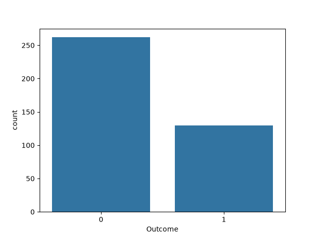
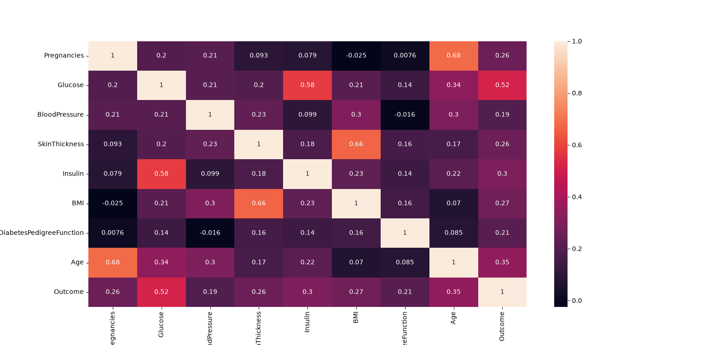

# 🩺 Diabetes Prediction using Logistic Regression

A machine learning classification project that uses **Logistic Regression** to predict whether a patient has diabetes based on medical diagnostic measurements. The project also uses data visualization to explore the distribution of diabetes outcomes and relationships between features.

## Overview

This project uses the **Diabetes dataset** to build a binary classification model.

The target variable, `Outcome`, indicates whether a patient has diabetes:

* `0` → No diabetes
* `1` → Diabetes

A **Logistic Regression** model is trained using the available medical features and evaluated on a test set.

The project also includes exploratory data analysis using **Seaborn** and **Matplotlib** to visualize the target distribution and correlations between features.

## Features

* 🩺 Diabetes prediction using Logistic Regression
* 🤖 Binary classification
* 📊 Train/test data splitting
* 📈 Prediction accuracy evaluation
* 📉 Mean Squared Error (MSE) calculation
* 📊 Diabetes outcome distribution visualization
* 🔥 Feature correlation heatmap
* 🐼 Dataset handling using Pandas
* 📚 Beginner-friendly machine learning implementation

## Technologies Used

* Python 3
* NumPy
* Pandas
* Scikit-learn
* Seaborn
* Matplotlib

## Dataset

The project uses a diabetes dataset originally provided as an Excel/CSV file named `diabetes.csv`.

The original dataset is **not normalized**, so the data is first preprocessed and normalized before being used for machine learning.

After preprocessing and normalization, the resulting dataset is saved as:

```text
diabetes2.csv
```

### Dataset Workflow

```text
diabetes.csv
     ↓
Data Preprocessing
     ↓
Data Normalization
     ↓
diabetes2.csv
     ↓
Train/Test Split
     ↓
Logistic Regression
     ↓
Prediction & Evaluation
```

The dataset contains medical diagnostic measurements used to predict whether a patient has diabetes.

The features include:

* Pregnancies
* Glucose
* BloodPressure
* SkinThickness
* Insulin
* BMI
* DiabetesPedigreeFunction
* Age

The target variable is:

* `Outcome`

where:

```text
0 = No Diabetes
1 = Diabetes
```

## Data Visualization

Before training the model, the project performs basic exploratory data analysis.

### Outcome Distribution

A count plot is used to visualize the number of patients in each outcome category.

```python
sns.countplot(x='Outcome', data=df)
```

### Feature Correlation

A correlation heatmap is used to examine relationships between the dataset's features.

```python
sns.heatmap(df.corr(), annot=True)
```

These visualizations provide a basic understanding of the dataset before training the machine learning model.

## Machine Learning Workflow

1. Load the dataset using Pandas from `diabetes2.csv`.
2. Visualize the distribution of diabetes outcomes.
3. Calculate and visualize feature correlations.
4. Separate the input features from the target variable.
5. Split the dataset into training and testing sets.
6. Train a Logistic Regression classifier.
7. Predict outcomes for the test dataset.
8. Calculate prediction accuracy.
9. Calculate Mean Squared Error.

## Model

The project uses **Logistic Regression** for binary classification.

```python
reg_logestic = linear_model.LogisticRegression()

reg_logestic.fit(x_train, y_train)

out_pred = reg_logestic.predict(x_test)
```

Logistic Regression is suitable for this problem because the target variable contains two possible outcomes: `0` or `1`.

## Project Structure

```text
Diabetes-Prediction-Logistic-Regression/
│
├── screenshots/
│   ├── outcome_distribution.png
│   └── correlation_heatmap.png
│
├── diabetes_prediction.py
├── diabetes.csv
├── diabetes2.csv
├── requirements.txt
├── LICENSE
└── README.md
```

## Installation

Clone the repository:

```bash
git clone https://github.com/Matin-python/Diabetes-Prediction-Logistic-Regression.git
```

Move into the project directory:

```bash
cd Diabetes-Prediction-Logistic-Regression
```

Install the required packages:

```bash
pip install -r requirements.txt
```

or install them manually:

```bash
pip install numpy pandas scikit-learn matplotlib seaborn
```

## How to Run

Run the Python script:

```bash
python diabetes_prediction.py
```

The program will:

* Load the diabetes dataset.
* Display the outcome distribution.
* Display the feature correlation heatmap.
* Train the Logistic Regression model.
* Predict diabetes outcomes for the test data.
* Display the prediction accuracy.
* Display the Mean Squared Error.

## Evaluation Metrics

The model is evaluated using:

### Accuracy

Accuracy represents the percentage of test samples that were correctly classified.

### Mean Squared Error

Mean Squared Error measures the average squared difference between the predicted and actual values.

For this binary classification problem, **accuracy is the more intuitive primary metric**, while MSE is included as an additional evaluation measure.

## Example Output

```text
--------------------------------------------------
Correct Prediction = XX.XX %

Mean Squared Error = X.XX
--------------------------------------------------
```

The exact results may vary between runs because the dataset is randomly divided into training and testing sets.

## Screenshots

### Outcome Distribution



### Feature Correlation Heatmap



## Future Improvements

* 📊 Confusion matrix visualization
* 📈 Precision, Recall, and F1-score
* 📋 Classification report
* 🔧 Feature scaling
* ⚙️ Hyperparameter tuning
* 🔀 Stratified train/test splitting
* 📊 ROC curve and AUC evaluation
* 🧪 Cross-validation
* 🤖 Comparison with other classification algorithms
* 💾 Save and load the trained model
* 🌐 Deploy the model as a web application

## Related Project

This project is the **Machine Learning implementation** of the diabetes prediction problem.

For a Deep Learning implementation of the same problem, see:

### Diabetes Prediction using Deep Learning

**Diabetes Prediction using Deep Learning**

https://github.com/Matin-python/Diabetes-prediction-Deep_Learning

The related project uses an **Artificial Neural Network (ANN)** built with **TensorFlow/Keras** to solve the same binary classification problem.

While this repository uses **Logistic Regression**, the related project explores a neural-network-based approach.

### 🆚 Machine Learning vs Deep Learning

| Aspect           | Machine Learning      | Deep Learning             |
| ---------------- | --------------------- | ------------------------- |
| Approach         | Logistic Regression   | Artificial Neural Network |
| Type             | Supervised Learning   | Supervised Learning       |
| Problem          | Binary Classification | Binary Classification     |
| Target           | `Outcome`             | `Outcome`                 |
| Framework        | Scikit-learn          | TensorFlow / Keras        |
| Model complexity | Relatively simple     | More complex              |

These two repositories demonstrate how different Machine Learning and Deep Learning approaches can be applied to the diabetes prediction problem.

## Contributing

Contributions, suggestions, and bug reports are welcome. Feel free to fork the repository and submit a pull request.

## License

This project is licensed under the MIT License.

## Author

**Mohammad Reza Bakhshandeh**

Electrical Engineering (Electronics) Graduate

Interested in Python Development, Machine Learning, Deep Learning, Computer Vision, Artificial Intelligence, and Game Development.
